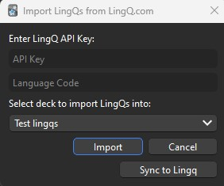
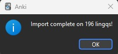

# Lingq Anki Sync

## Requirements
You will need your lingq API key. You can get that [here](https://www.lingq.com/en/accounts/apikey/).

The language code for the lingq language you want to sync with. Example: "es"


## Usage:
A menu item to open the ui can be found under Tools > Import LingQs from LingQ.com. 



Input your lingq api key and language code, then select the deck you want to sync lingqs to or that you want to sync lingq known status based on the card interval. (Currently you should create a new deck only used for lingq's and import into that new deck, and only sync from that deck). 

Click the "import" button to import all of your lingqs for that language code into the selected anki deck. 

Click the "sync to Lingq" button to update the "known status" on your lingqs based on the interval of the card in anki. (As a precaution this addon will not set a lower known status in lingq, it will only raise it). 

Be Patient, either of these operations will take some time. Once the operation completes you will see this screen and it will tell you how many Lingqs were imported.



After importing your API key and language code should be preserved for the next time you want to import or sync!

## What does it currently do?
As the name implies the goal is to sync between lingq and anki. This addon is currently in early development, but it has the following features:
- Import lingq's from a specified language to anki cards
  - This will also set the due date of the anki card based on the "known status" in Lingq. 
    - The current status to interval definition is: {0: 0, 1: 5, 2: 10, 3: 20, 4: 40}
    - Lingq status : Interval (due date will be current day + interval)
    - 1 : 0
    - 2 : 5
    - 3 : 10
    - 4 : 20
    - 'known' : 40
  - Cards are rudimentary currently, just the word on the front and the translation on the back.
  - You can modify the look of the card, but the fields that are generated are required and can not be altered at this time.
- Sync lingq status based on the interval of the anki card.
  - This will update your known status on lingq. 
  - This uses the reverse of the lingq status : interval shown above. 
  - For example, if your card interval is 21, then it will set your lingq status as 4
  - There is a built in check, it will never lower your lingq status.
    - This is done as a precaution to not remove lingq progress

## Why does it exist?
Lingq is a great tool for reading in your target language, but I prefer to use anki as my SRS. Lingq has an option to export lingqs to anki, however it has some flaws which this addon attempts to address:
1. The cards it sends you have no history, they all start as a "new" status in anki even if your lingq status for the card was "known".
2. There is no syncing between anki and lingq. If I import a card from lingq that has a known status of "1", then review it in anki until I know the word, lingq will not update. This means I wouldn't get an accurate % words known when looking at lingq lessons and it breaks the flow to mark an already known word as known in lingq manually. The reverse is also true, if I start reading on lingq and mark a word as known, that word could still be shown as new in anki.
3. If you add a new lingq you have to create a full new anki export via the lingq website. Sometimes anki decks don't merge well, so you could lose progress in anki just to import a new word from lingq.
4. The [lingq API documentation](https://www.lingq.com/apidocs/) is not very good. I want to document some of the undocumented API calls available. 


## Future Goals:
- Import to custom note type.
- Allow user to define what interval relates to what lingq known status.
- Sync lingq status to anki
- Better error catching and handling
- Save settings for each language synced with lingq (what deck, note type, etc)
- Allow to "sign in" with username and password instead of needing to copy / paste API key
- Allow to remember api key / credentials or need to enter them each time


## Lingq API Documentation
### This is a temporary measure, hopefully lingq updates their own API docs, or I may make a better one than this. 

### Authentication
There is an API endpoint to retrieve your API key for lingq in their documentation. It's easiest to use this in dev at least. 

#### Api auth key is set up in postman as:
```
Type: API Key
Key: Authorization
value: Token {apiKey}
add to: Header
```


### Objects
#### Lingq object

Lingq object is refering to a single lingq (word).
```
{
    "pk": primaryKey,
    "url": url to get single card info,
    "term": string,
    "fragment": string,
    "importance": int,
    "status": int,
    "extended_status": null,
    "last_reviewed_correct": null,
    "srs_due_date": date,
    "notes": string,
    "audio": null,
    "words": string[],
    "tags": string[],
    "hints": hintObject[],
    "transliteration": {},
    "gTags": [],
    "wordTags": [],
    "readings": {}
}
```
#### Hint object
```
{
    "id": int,
    "locale": string,
    "text": string,
    "term": string,
    "popularity": int,
    "is_google_translate": bool,
    "flagged": bool
}
```


### GET
#### 1. Get lingqs from a language: 
`https://www.lingq.com/api/v3/{languageCode}/cards`

Will return this json with the first 100 lingqs:
```
{
    "count": int,
    "next": string,
    "previous": string,
    "results": [
        List of lingq objects
    ]
}
```

Add ?page={pageNumber} to return a specific page of cards

#### 2. Get single card by primary key
`https://www.lingq.com/api/v3/{languageCode}/cards/{primaryKey}/`

Will return a single lingq object that matches the primaryKey within the language code. If an invalid primaryKey is supplied the api will return a 404 Not found with a return body of 

```"detail": "Not Found."```


### Patch
#### 1. Update a lingq object
`https://www.lingq.com/api/v2/{languageCode}/cards/{primarykey}/`

Body Json object of the items that will be changing in the lingq object. 
Example:
```
{
    "status": 2
}
```
Note: Not all fields of the object can be updated here. I have tested the following:
1. status (the known status, 0-5).
2. tags

### Post
#### 1. Set card reviewed
`https://www.lingq.com/api/v2/{languageCode}/cards/{primaryKey}/review/`

Tells lingq that the card has been reviewed via srs on the date this is sent. Will update lingqs srs_due_date. 

It seems like this needs to be called instead of changing the due date manually with the patch request.

Returns an object showing the new srs_due_date and status_changed_date:
```
{
    "srs_due_date": date,
    "status_changed_date": date
}
```
